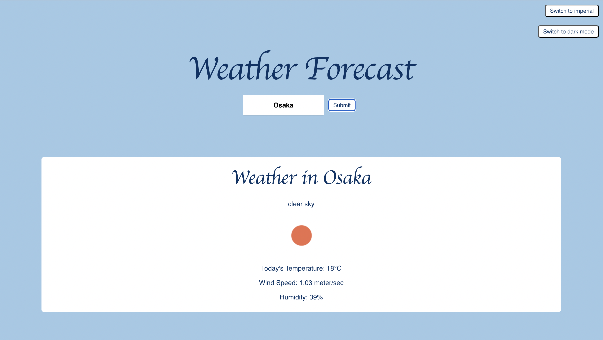

# Weather Forecast

This website will allow you to get the 5 day forecast in any city in celcius or farenheit.

## How It's Made

### Tech used: HTML, CSS, Javascript, React, Emotion

This weather forecast website utilizes API fetch to find the longitude and latitude of any city inputted into the search box and then use that data to fetch the weather forecast for the next 5 days based on that information.

It includes a button that allows users to switch from the metric system to the imperial system by changing the contents of the API fetch based on whether the unit has been set to imperial or metric based on the button click. 

It also includes a button that allows users to switch to a dark mode theme, switching the prop accessed by theme based on whether the app is set IsDarkMode or not.

## Lessons Learned:
This project was my first attempt to utilize React components that I have been studying about, such as API fetch requests, useState, useEffect and the Emotion library. 

Getting accurate weather data presented a bit of a challenge, as random weather points were being displayed. In an attempt to pick a data point that was the most representative of the day's weather, I used a condition to retrieve the information closest to noon for each day so as to retrieve information from midday.

In the future I hope to implement hourly forcasts as well as the ability to pin cities to a user's favorited cities for easier access. 
